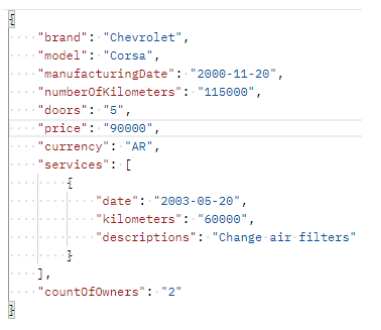

# Concessionária de Veículos

- Java + Spring II - Prática Integradora II

Uma concessionária de carros deseja criar uma API REST que permita carregar
determinados carros usados.

Para fazer isso, precisamos desenvolver os
seguintes endpoints:

Sendo o proprietário da concessionária um cliente muito exigente, sugere-se a
realização de boas práticas de programação como a separação do projeto de
acordo com a Arquitetura Multicamada.

Tenha em mente que no momento, como não trabalhamos com banco de dados,
podemos implementar coleções (listas, arraylists, etc) para tratar CRUDs de forma
lógica.

Por outro lado, um analista funcional nos fornece o seguinte exemplo de Payload para levar em consideração ao se registrar através do método POST:

